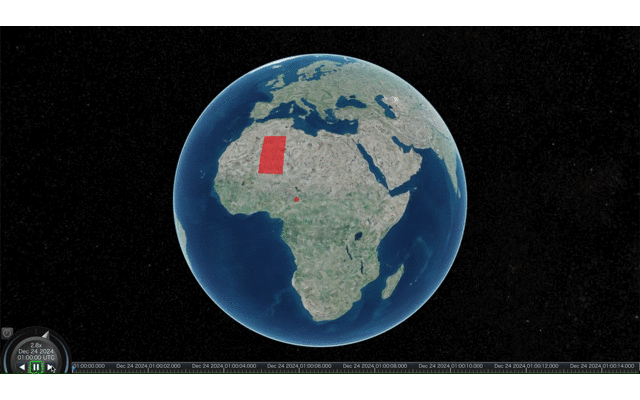
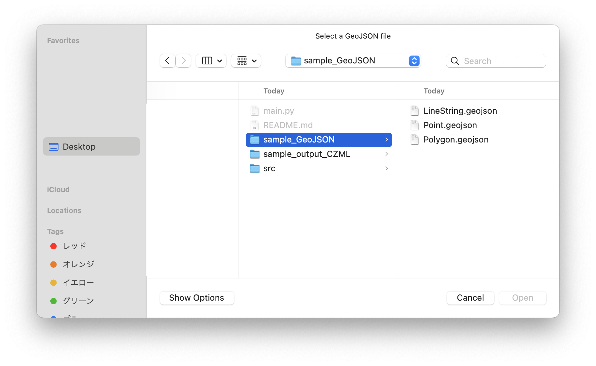

# time-series-czml-generator

### WHat is this tool
This is a Python script to convert GeoJSON with timestamps to CZML for time series data.
   
  

### What you shold do
1. **Prepare a Geojson data**   
This script can only input GeoJSON. it does not support Shp or CSV. GeoJSON must have the properties "start_time" and "end_time" The "start_time" property describes the start time the data is displayed, and the "end_time" property describes the end time the data is displayed."start_time" and "end_time" must be written according to [ISO 8601](https://en.wikipedia.org/wiki/ISO_8601).
GeoJSON samples are available and can be checked [here](./sample_GeoJSON).

2. **Check the geometry type**      
To run this script, the geometry type must be Point, MultiPoint, LineString, MultiLineString, Polygon, or MultiPolygon. Other types are not supported.

3. **Run the Script**   
Run the script locally. When the script is executed, a file selection screen will appear as shown in the image below, select GeoJSON, and when processing is complete, "output.czml" will be created in the same hierarchy as the executed script.Sample CZML files can be found [here](./sample_output_CZML).
